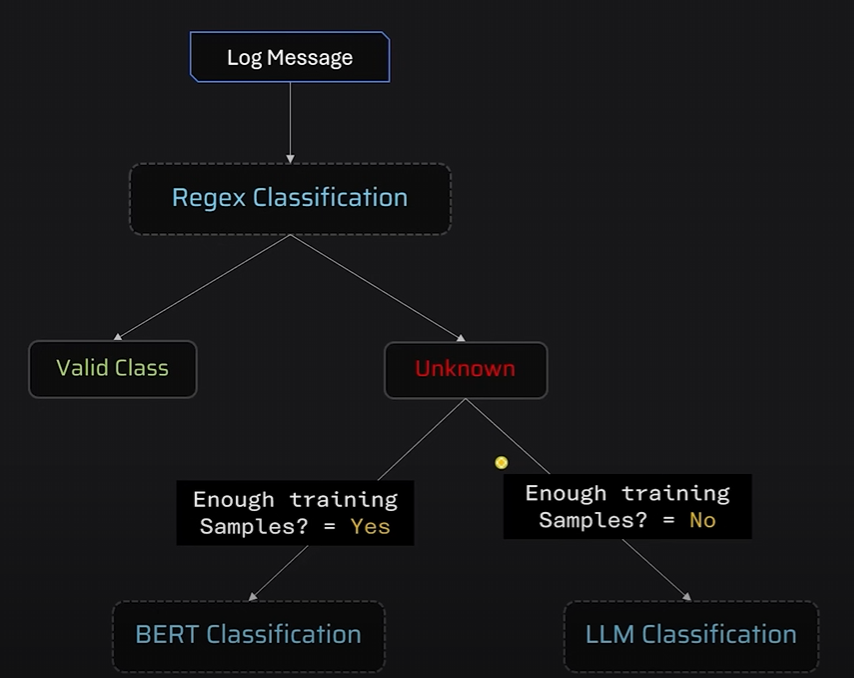

# Log Classification System

This project is a **log classification pipeline** that uses a combination of **Regex**, **BERT embeddings**, and an **LLM** to automatically categorize system and application log messages. It is designed for flexible log analysis across multiple sources (CRM, HR, Billing, Analytics systems, etc.).

---

## 📌 Features
- **Regex-based classification** for common patterns (user login, backup, uploads, etc.)
- **BERT-based classifier** (`sentence-transformers`) for semantic understanding of log messages
- **LLM integration** (`Groq API`) for handling LegacyCRM messages with complex workflow/deprecation warnings
- **CSV support**: Reads logs from a `.csv` file and outputs a classified `.csv`
- **Extensible**: Easy to add new regex rules, models, or LLM prompts

---

## 📂 Project Structure
```
classification_logs/
│── classify.py              # Main script for CSV classification
│── processor_regex.py        # Regex-based classifier
│── processor_bert.py         # BERT-based classifier
│── processor_llm.py          # LLM-based classifier
│── models/
│    └── classification_model.joblib   # Pre-trained sklearn model
│── resources/
│    ├── test.csv             # Sample input log file
│    └── output.csv           # Classification output
│── requirements.txt          # Project dependencies
```


---

## ⚙️ Installation

### 1. Clone the repo
```bash
git clone https://github.com/developer-prabhu-charan/GenAI_Classification_Logs.git
```

### 2. Create a virtual environment
```bash
python -m venv venv
source venv/bin/activate     # On Linux/Mac
venv\Scripts\activate        # On Windows
```

### 3. Install dependencies
```bash
pip install -r requirements.txt
```

---

## ▶️ Usage

### Run classification on sample CSV
```bash
python classify.py
```

This will read `resources/test.csv` and produce `resources/output.csv` with an additional `target_label` column.

### Sample Input (`test.csv`)
```csv
source,log_message
BillingSystem,User User12345 logged in.
AnalyticsEngine,Backup completed successfully.
LegacyCRM,The 'BulkEmailSender' feature is no longer supported.
```

### Sample Output (`output.csv`)
```csv
source,log_message,target_label
BillingSystem,User User12345 logged in.,User Action
AnalyticsEngine,Backup completed successfully.,System Notification
LegacyCRM,The 'BulkEmailSender' feature is no longer supported.,Deprecation Warning
```

---

## 🧠 Classification Logic

1. **LegacyCRM logs** → Processed by **LLM** (`Groq API`)  
   - Categories: *Workflow Error*, *Deprecation Warning*  
2. **Other logs** → Processed by **Regex rules**  
   - Categories: *User Action*, *System Notification*, etc.  
3. If Regex fails → Fall back to **BERT classifier** (`sentence-transformers`)  
   - Categories: *Security Alert*, *HTTP Status*, *Error*, *Unclassified*  

---

## 📦 Dependencies
Key dependencies are listed in `requirements.txt`:
- pandas  
- scikit-learn  
- joblib  
- sentence-transformers  
- torch  
- transformers  
- huggingface-hub  
- groq  
- python-dotenv  

Install all with:
```bash
pip install -r requirements.txt
```

---

## 🔮 Future Improvements
- Add more robust regex patterns for enterprise logs  
- Fine-tune the BERT model with larger labeled log dataset  
- Expand LLM categories (e.g., *Performance Issue*, *Security Alert*)  
- Add a REST API or Web UI for real-time log classification  

---

## 📝 License
MIT License – free to use and modify.
